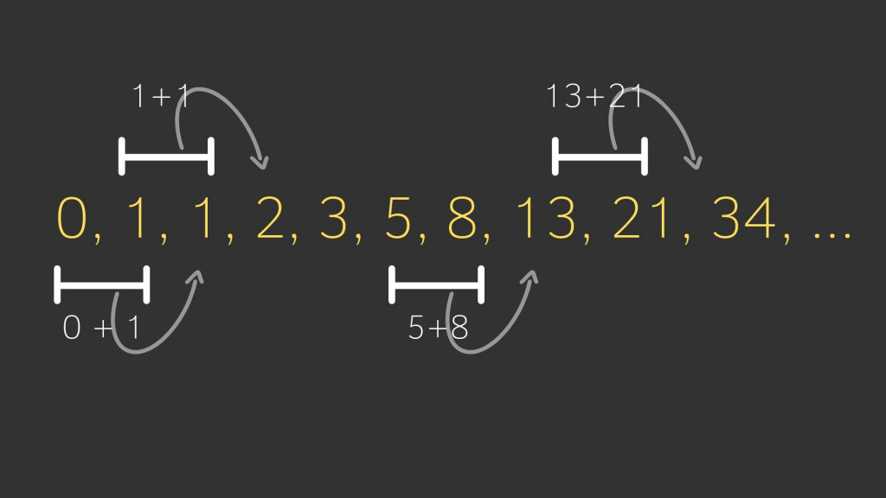
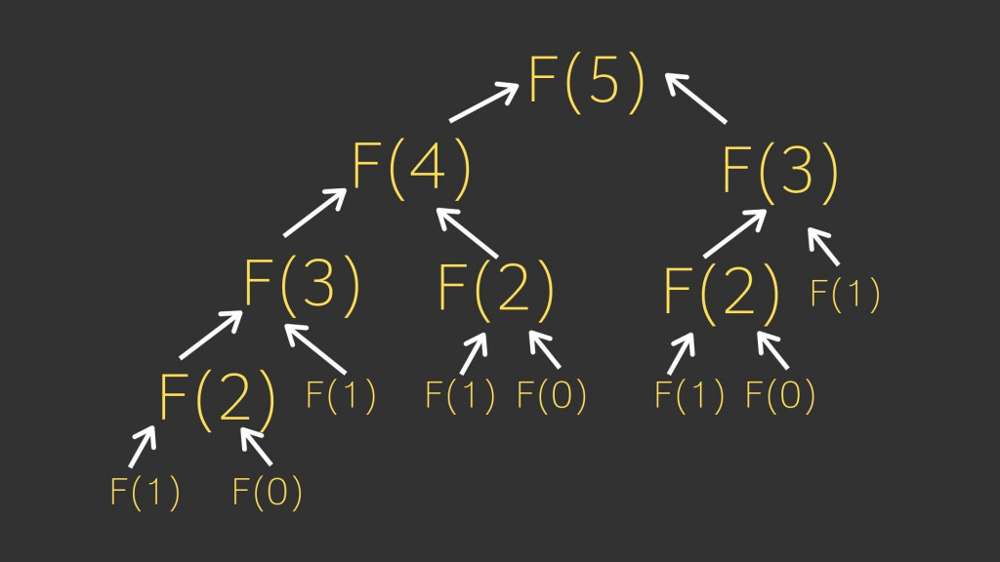
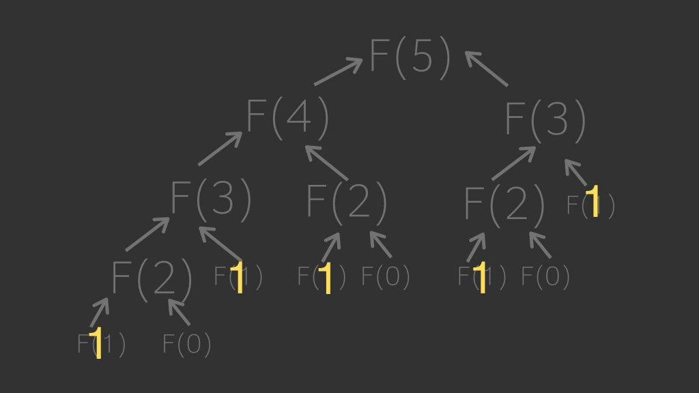

# Fibonacci 費波那契序列指的就是

0, 1, 1, 2, 3, 5, 8, 13, 21, 34, 55, 89, ...

每個數字都是前兩個的總和, 0 + 1 = 1, 1+1 = 2, 2+1 = 3 以此類推

- 第 0 項 F(0) = 0
- 第 1 項 F(1) = 1
- 第 n 項 F(n ) = f( n-1 ) + f( n-2 ) // 第 n-1 項 + 第 n-2 項

## 觀察 Big O

- 每次步驟變兩倍
- 總共有 n 層,
- 時間複雜度是 O(2^n)
  
  每一項都分成 f(n-1) + f(n-2) 一直拆到 f(1) = 1, f(0) =0 為止, 然後再把它全部加起來 (黃色數字) 就等於 5，而總共要執行 15 次這個函式

時間複雜度為 O(2^n) , 也就是 2 的 n 次方. 實際上來說這樣的執行速度非常慢, 例如 input 是 100 時，執行步驟會暴增到 30 位數．這樣的時間複雜度在設計演算法需要避免
