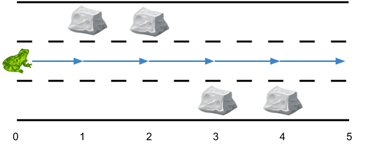
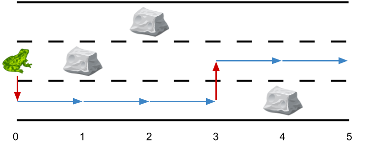

# 1824. Minimum Sideway Jumps

There is a 3 lane road of length n that consists of n + 1 points labeled from 0 to n. A frog starts at point 0 in the second lane and wants to jump to point n. However, there could be obstacles along the way.

You are given an array obstacles of length n + 1 where each obstacles[i] (ranging from 0 to 3) describes an obstacle on the lane obstacles[i] at point i. If obstacles[i] == 0, there are no obstacles at point i. There will be at most one obstacle in the 3 lanes at each point.

For example, if obstacles[2] == 1, then there is an obstacle on lane 1 at point 2.
The frog can only travel from point i to point i + 1 on the same lane if there is not an obstacle on the lane at point i + 1. To avoid obstacles, the frog can also perform a side jump to jump to another lane (even if they are not adjacent) at the same point if there is no obstacle on the new lane.

For example, the frog can jump from lane 3 at point 3 to lane 1 at point 3.
Return the minimum number of side jumps the frog needs to reach any lane at point n starting from lane 2 at point 0.

Note: There will be no obstacles on points 0 and n.

Example 1:


```
Input: obstacles = [0,1,2,3,0]
Output: 2
Explanation: The optimal solution is shown by the arrows above. There are 2 side jumps (red arrows).
Note that the frog can jump over obstacles only when making side jumps (as shown at point 2).
```

Example 2:



```
Input: obstacles = [0,1,1,3,3,0]
Output: 0
Explanation: There are no obstacles on lane 2. No side jumps are required.
```

Example 3:


```
Input: obstacles = [0,2,1,0,3,0]
Output: 2
Explanation: The optimal solution is shown by the arrows above. There are 2 side jumps.
```
