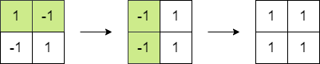

## 1975. Maximum Matrix Sum

You are given an n x n integer matrix. You can do the following operation any number of times:

Choose any two adjacent elements of matrix and multiply each of them by -1.
Two elements are considered adjacent if and only if they share a border.

Your goal is to maximize the summation of the matrix's elements. Return the maximum sum of the matrix's elements using the operation mentioned above.
Example 1:



```
Input: matrix = [[1,-1],[-1,1]]
Output: 4
Explanation: We can follow the following steps to reach sum equals 4:
- Multiply the 2 elements in the first row by -1.
- Multiply the 2 elements in the first column by -1.
```

Example 2:


```
Input: matrix = [[1,2,3],[-1,-2,-3],[1,2,3]]
Output: 16
Explanation: We can follow the following step to reach sum equals 16:
- Multiply the 2 last elements in the second row by -1.
```

**Constraints**:

n == matrix.length == matrix[i].length
2 <= n <= 250
-105 <= matrix[i][j] <= 105

## Thought

Approach

1. Find the absolute sum of all the numbers in the matrix
2. Find the absolute value of the smallest number in the matrix
3. Count of negative numbers in the matrix

- If count of negatives is even, then all elements can be made positive by performing the operation, so just return the total sum of the matrix
- If count of negatives is odd, then we can make the smallest number in the matrix as negative and then return the sum

NOTE : Here the result will be `sum-2*minElement` as you are not including this element.

[ref](https://leetcode.com/problems/maximum-matrix-sum/discuss/1417574/C%2B%2B-Explained-with-Diagram)
