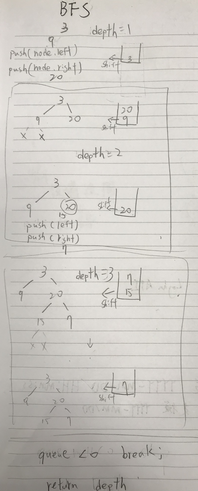

# 104. Maximum Depth of Binary Tree

Given a binary tree, find its maximum depth.

The maximum depth is the number of nodes along the longest path from the root node down to the farthest leaf node.

Note: A leaf is a node with no children.

Example:

Given binary tree [3,9,20,null,null,15,7],

```
    3
   / \
  9  20
    /  \
   15   7
```

return its depth = 3.

## Thoughts 1

- Breadth-First Search 廣度搜尋
  1. 使用 queue 來解題，以上圖範例
  2. queue = [Root]
  3. While 迴圈 queue 有節點 depth+1， 判斷當下節點使否有 left 與 right， 有就 push 到 queue
  4. 重複做到 queue 沒結點, return depth
  
