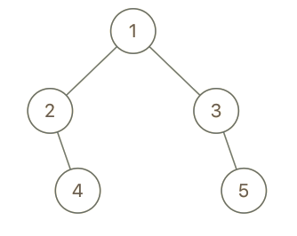

# 993. Cousins in Binary Tree

In a binary tree, the root node is at depth 0, and children of each depth k node are at depth k+1.

Two nodes of a binary tree are cousins if they have the same depth, but have different parents.

We are given the root of a binary tree with unique values, and the values x and y of two different nodes in the tree.

Return true if and only if the nodes corresponding to the values x and y are cousins.

Example 1:


```
Input: root = [1,2,3,4], x = 4, y = 3
Output: false
```

Example 2:


```
Input: root = [1,2,3,null,4,null,5], x = 5, y = 4
Output: true
```

Example 3:


```
Input: root = [1,2,3,null,4], x = 2, y = 3
Output: false
```

Constraints:

The number of nodes in the tree will be between 2 and 100.
Each node has a unique integer value from 1 to 100.

## Thoughts- BFS

1. 使用 BFS 遍歷
2. 搭配 hash map 紀錄每個節點 key 為 node.val， value 紀錄該點的 parent 與 depth
3. 最後找出 X,Y 得 value 作比較，如果 depth 一樣 parent 不一樣就 return true 反之

Time complexity O(n) 我們遍歷每個節點

Space complexity O(n) 因為有使用 queue 與 map
