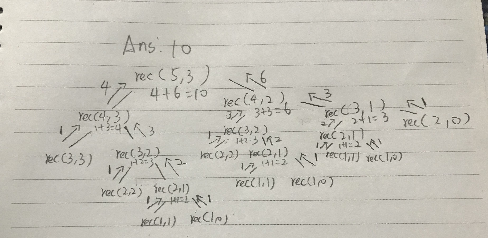

# 演算法實做

透過遞回函式來實做一個階層（!）的函式：

```
function factorial (num) {
  if (num === 1) {
    return num
  } else {
    return num * factorial(num - 1)
  }
}
factorail(4) //24
```

可以看到，當 num 不等於 1 的時候，它會去呼叫自己
`（return num * factorial(num-1)`，
如果 num 等於 1 時，才會回傳結果。
因此實際上執行的過程會像這樣：


# index3 雙遞迴

```
function rec(a, b) {
  if (a == b || b == 0) {
    return 1;
  }
  return rec(a - 1, b) + rec(a - 1, b - 1);
}

console.log(rec(5, 3));

```


[Reference video](https://www.youtube.com/watch?v=B3U6LExgevE&t=689s)
