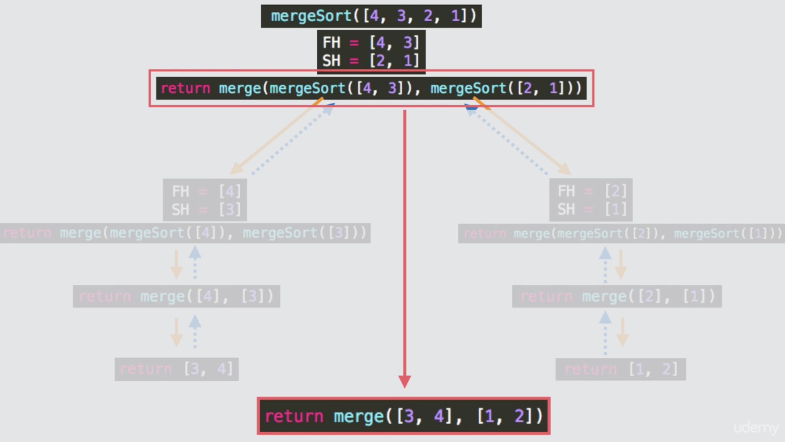

## Thoughts

1. Merge Sort 的第一步是要將陣列兩兩對半拆分，直到拆到每個陣列只剩一個元素：

```
// 原本的陣列
[3, 20, 8, 5, 1, 12, 17, 2]
// 進行對半拆分
[3, 20, 8, 5], [1, 12, 17, 2]
// 再拆分
[3, 20], [8, 5], [1, 12], [17, 2]
// 再拆分
[3], [20], [8], [5], [1], [12], [17], [2]
```

2. 將陣列排序後加以合併

```
// 拆分好的陣列
[3], [20], [8], [5], [1], [12], [17], [2]

// [3] vs [20]; [8] vs [5]; [1] vs [12]; [17] vs [2]
// 兩兩比較排序後合併，每次比較都是取當時陣列中的第一個元素進行比較
[3, 20], [5, 8], [1, 12], [2, 17]

// 再一次兩兩比較後排序後合併，每次比較都是取當時陣列中的第一個元素進行比較
[3, 5, 8, 20], [1, 2, 12, 17]

// 再一次兩兩比較後排序後合併，每次比較都是取當時陣列中的第一個元素進行比較
[ 1, 2, 3, 5, 8, 12, 17, 20 ]
```


## 圖像化思考

上面這個情況可能會有點難想像實際上的遞回是怎麼執行的，假設我們現在執行函式：
`mergeSort([4, 3, 2, 1])`

它實際上會先將陣列拆成 `[4, 3]` 和 `[2, 1]`，接著
`return sortBeforeMerge(mergeSort[4, 3], mergeSort[2, 1])`

這時候遞回函式就需要先去計算出 `mergeSort[4, 3] 和 mergeSort[2, 1]` 的值。
以 `mergeSort[4, 3]` 為例，它則是會先把陣列拆成`[4], [3]`，接著 `return sortBeforeMerge([4], [3])` ，在經過 sortBeforeMerge 的函式時，它會取這兩個陣列當時的第一個元素比較大小，最後會回傳 `[3, 4]`。
同理， `mergeSort[2, 1]` 在經過 `sortBeforeMerge([2], [1])` 之後，會回傳 [1, 2]。
如下圖所示：

因此一開始的：
`return sortBeforeMerge(mergeSort[4, 3], mergeSort[2, 1])`
便會變成：
`return sortBeforeMerge([3, 4], [1, 2])`
最後便會得到 `[1, 2, 3, 4]`。

